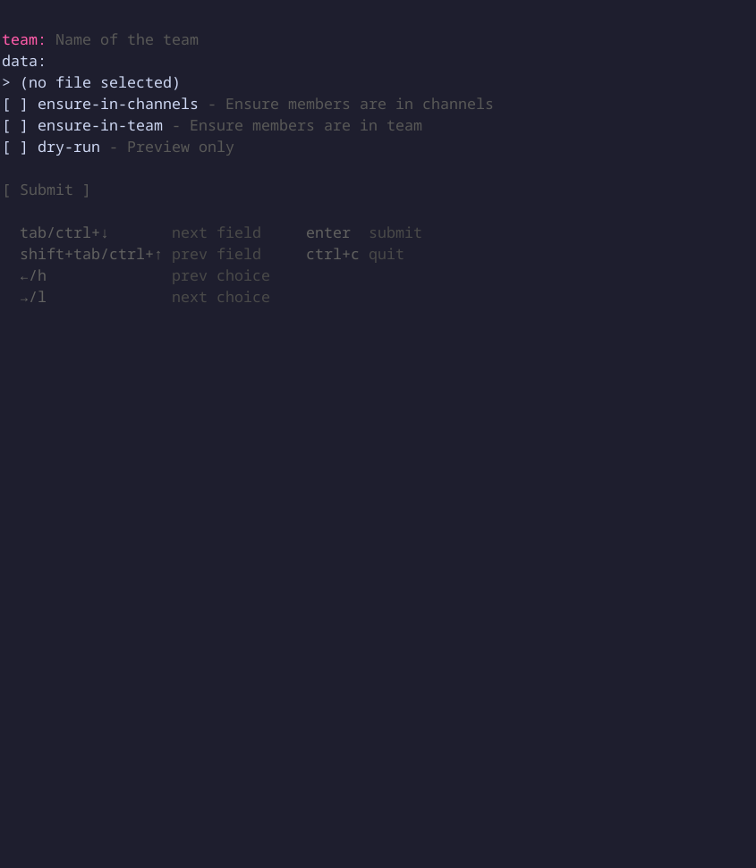

Create channels from file

### Synopsis

Create multiple Teams channels with members from a data file
(YAML/JSON/TOML/CSV).

The data file should contain channel definitions with channel_ref, role, and
user_refs.

### Data file format

YAML example:

```yaml
general:
  owners:
    - user.one@example.com
  members:
    - user.two@example.com
announcements:
  owners:
    - user.three@example.com
  members: []
```

JSON example:

```json
{
  "general": {
    "owners": ["user.one@example.com"],
    "members": ["user.two@example.com"]
  },
  "announcements": {
    "owners": ["user.three@example.com"],
    "members": []
  }
}
```

TOML example:

```toml
[general]
owners = ["user.one@example.com"]
members = ["user.two@example.com"]

[announcements]
owners = ["user.three@example.com"]
members = []
```

### Usage

```
teams-cli channels create [flags]
```

### Options

```
      --data string          Path to channels data file (YAML/JSON/TOML/CSV)
      --dry-run              Preview only
      --ensure-in-channels   Ensure members are in channels
      --ensure-in-team       Ensure members are in team
  -h, --help                 help for create
      --team string          Name of the team
```

### Examples

#### Create channels from YAML file

```bash
teams-cli channels create --team myteam --data channels.yaml
```

#### Create channels from JSON file

```bash
teams-cli channels create --team myteam --data channels.json
```

#### Dry run to preview

```bash
teams-cli channels create --team myteam --data channels.yaml --dry-run
```

#### Ensure members are added to channels if they already exist

```bash
teams-cli channels create --team myteam --data channels.yaml --ensure-in-channels
```

#### Ensure members are members of the team

```bash
teams-cli channels create --team myteam --data channels.yaml --ensure-in-team
```

### TUI Preview


