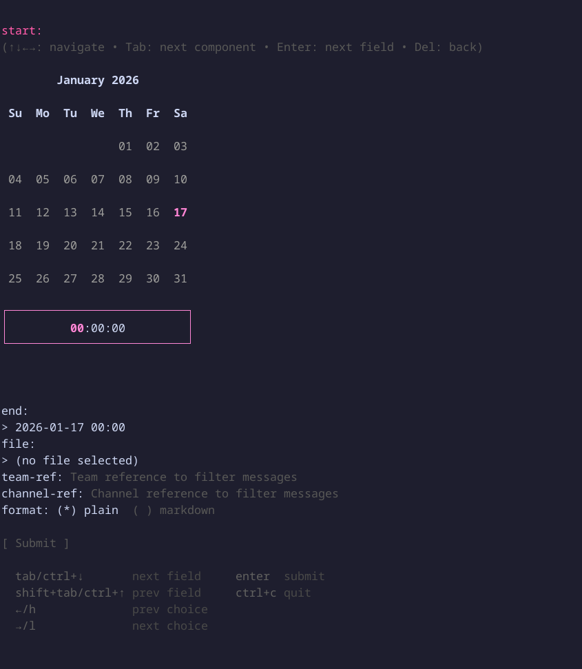

Get messages

### Synopsis

Retrieve messages from all channels you have access to within the specified time
range.

### Usage

```
teams-cli channels messages get [flags]
```

### Options

```
      --channel-ref string   Channel reference to filter messages
      --end string           End time
      --file string          Output file
      --format string        Output format {markdown, plain}
  -h, --help                 help for get
      --start string         Start time
      --team-ref string      Team reference to filter messages
```

### Examples

#### Last 24 hours (default)

```bash
teams-cli channels messages get
```

#### Specific time window

```bash
teams-cli channels messages get --start "2024-01-01 10:00" --end "2024-01-01 11:00"
```

#### Filter by team

```bash
teams-cli channels messages get --team "My Team"
```

#### Filter by channel and team

```bash
teams-cli channels messages get --team "My Team" --channel "General"
```

#### Save results to a file

```bash
teams-cli channels messages get --file messages.json
```

#### Use a different output format

```bash
teams-cli channels messages get --format markdown
```

### TUI Preview


