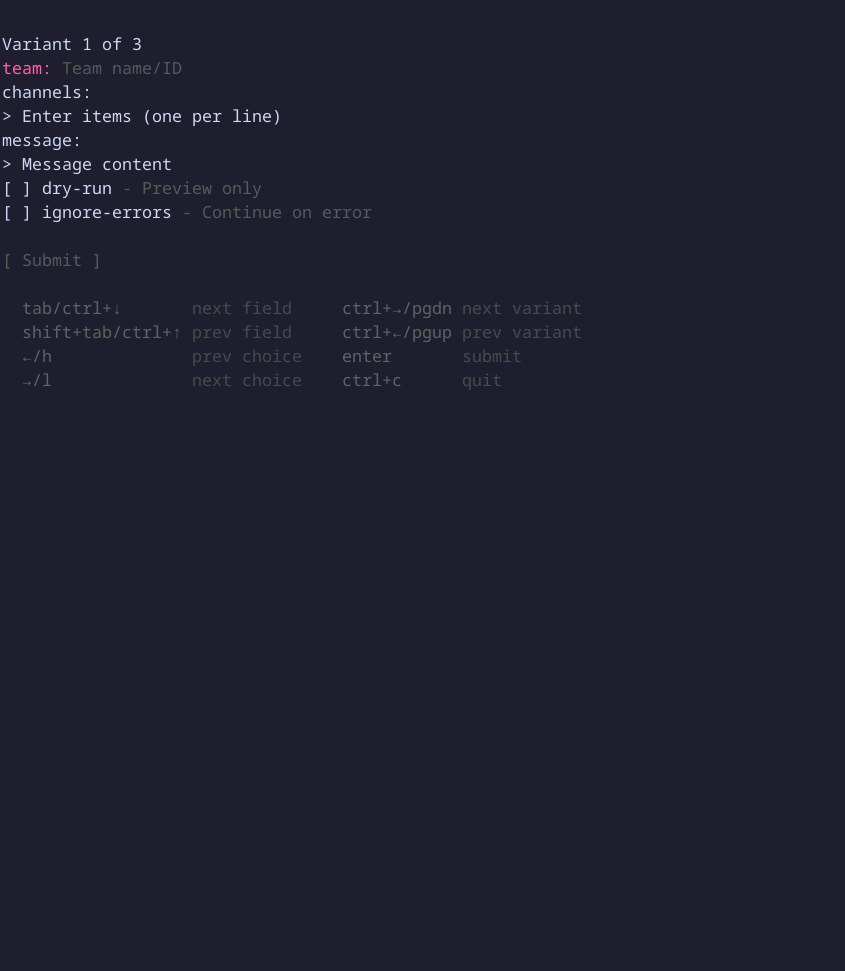
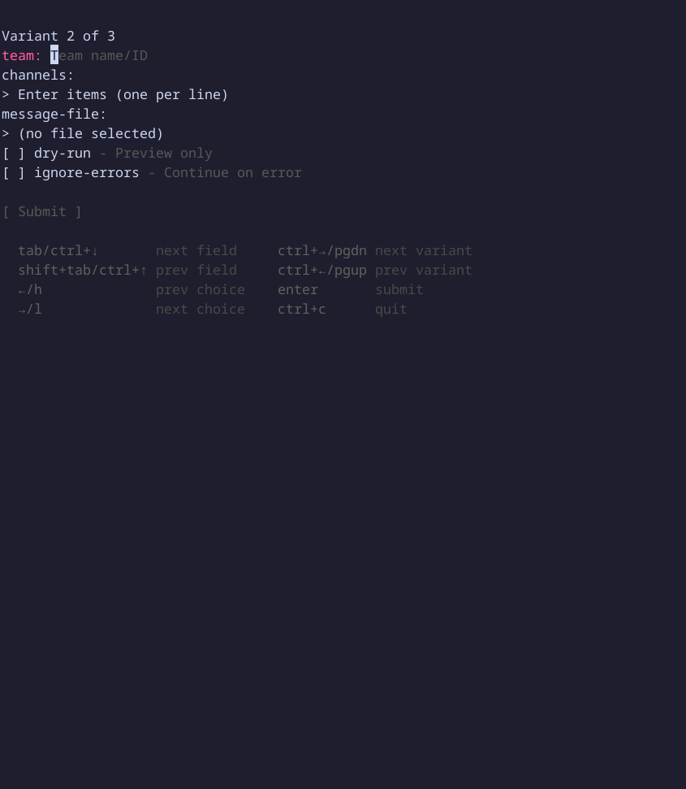
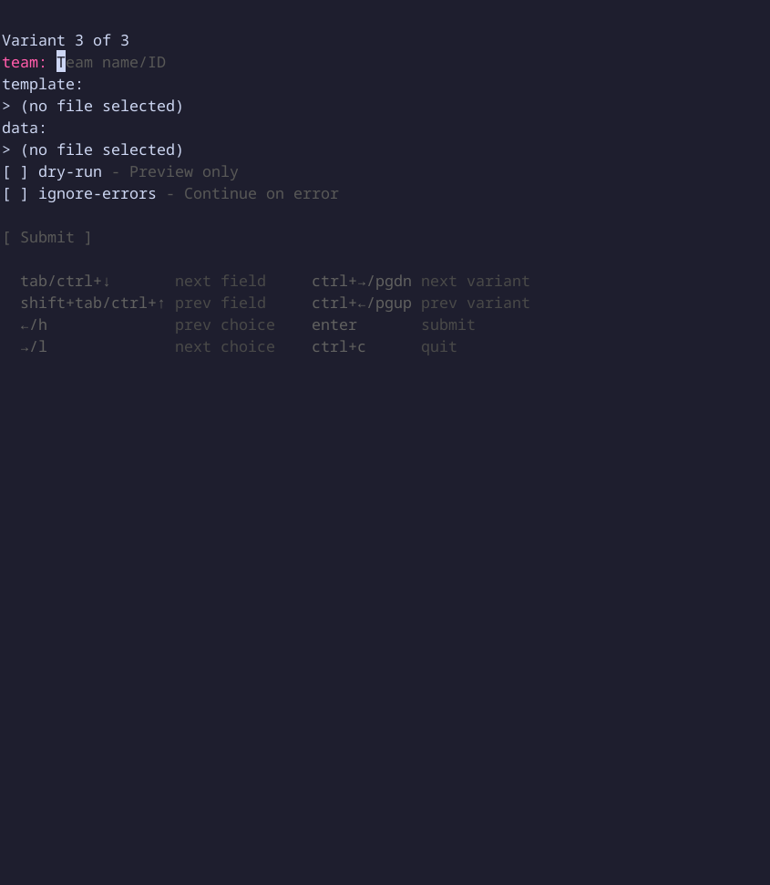

Send message

### Synopsis

Send messages to one or more Teams channels using templates, raw strings, or text files.
See [Message templates](../message-templates/index.md) for template syntax and examples.

### Usage

```
teams-cli channels messages send [flags]
```

### Options

```
      --channels strings      Channels list
      --data string           Template data
      --dry-run               Preview only
  -h, --help                  help for send
      --ignore-errors         Continue on error
      --message string        Message content
      --message-file string   Message file
      --team string           Team name/ID
      --template string       Template file
```

### Examples

#### Send templated messages

```bash
teams-cli channels messages send --template msg.txt --data recipients.yaml --team MyTeam
```

#### Send raw message to specific channels

```bash
teams-cli channels messages send --message "Hello team!" --channels General,Announcements --team MyTeam
```

#### Send message from file

```bash
teams-cli channels messages send --message-file msg.txt --channels General --team MyTeam
```

#### Dry run to preview

```bash
teams-cli channels messages send --template msg.txt --data recipients.yaml --team MyTeam --dry-run
```

### TUI Preview








