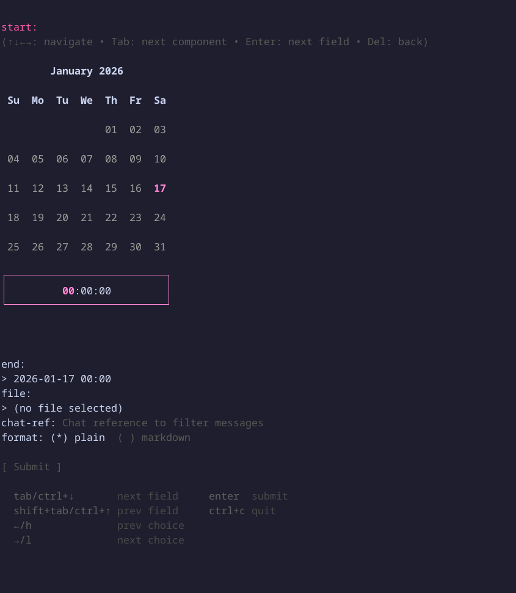

Get messages

### Synopsis

Retrieve messages from all chats you have access to within the specified time
range.

### Usage

```
teams-cli chats messages get [flags]
```

### Options

```
      --chat-ref string   Chat reference to filter messages
      --end string        End time
      --file string       Output file
      --format string     Output format
  -h, --help              help for get
      --start string      Start time
```

### Examples

#### Last 24 hours (default)

```bash
teams-cli chats messages get
```

#### Specific time window

```bash
teams-cli chats messages get --start "2024-01-01 10:00" --end "2024-01-01 11:00"
```

#### Filter by chat

```bash
teams-cli chats messages get --chat-ref "<chat-reference>"
```

### TUI Preview



